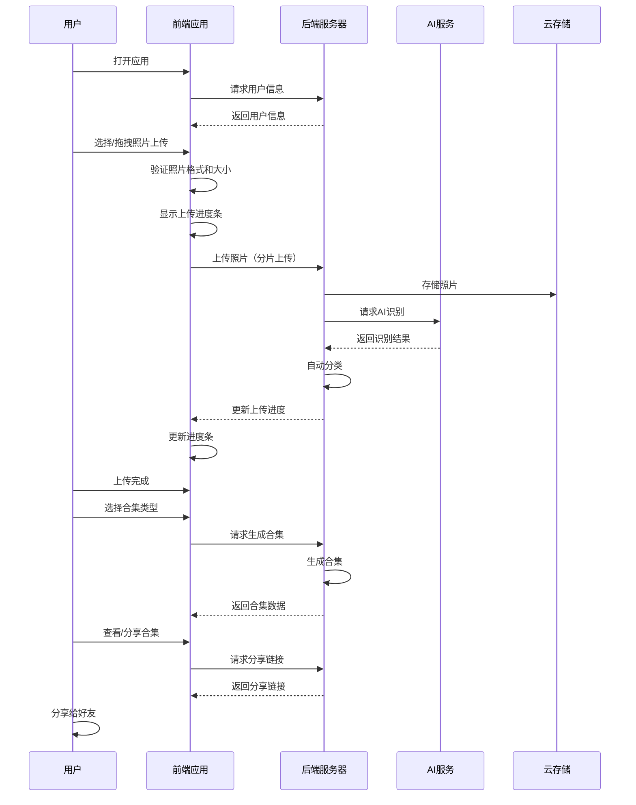

# 照片旅游合集 - 产品需求文档 (PRD)

## 1. 产品路线图

### 核心目标 (Mission)
帮助用户轻松上传、自动分类和分享一整年的照片，通过AI智能识别照片信息，生成多维度的精美合集，让用户更好地记录和回顾生活。

### 用户画像 (Persona)
- **用户群体**：热爱旅行、喜欢拍照记录生活的年轻人（18-35岁）
- **核心痛点**：
  - 照片数量庞大，手动分类耗时耗力
  - 重要照片容易被淹没，难以查找和回顾
  - 现有照片应用分类功能单一，缺乏智能性
  - 希望能够轻松分享自己的照片故事
  - 跨设备访问照片不便

### V1: 最小可行产品 (MVP)
1. **稳定的多张照片上传功能**
   - 修复现有上传bug，确保1000张以内照片能稳定上传
   - 可视化上传进度条，显示实时上传状态
   - 支持拖拽和点击两种上传方式
   - 上传失败时提供明确的错误提示和重试机制

2. **基于EXIF的自动分类**
   - 按季节自动分类
   - 按地点自动分类（无GPS时标记为"奇幻地点"）
   - 基本的AI内容识别（风景类型、活动场景）

3. **多维度合集呈现**
   - 主题相册视图
   - 时间线视图
   - 地理位置视图（地图形式）
   - 用户可在三种视图间切换

4. **云端存储与跨设备访问**
   - 照片存储在云端
   - 支持跨设备访问同一账户的照片

5. **合集分享功能**
   - 生成手机端友好的长网页分享链接
   - 支持复制分享链接

### V2 及以后版本 (Future Releases)
1. **高级AI识别功能**
   - 人物识别与分类
   - 人物情绪识别
   - 更精细的活动类型识别
   - 照片相似度分析与智能分组

2. **增强的用户自定义功能**
   - 自定义合集创建
   - 手动调整AI分类结果
   - 自定义主题和封面

3. **高级分享功能**
   - 支持多种分享渠道（微信、微博等）
   - 支持设置分享权限（公开/私密/指定好友）
   - 支持生成短视频分享

4. **增强的浏览体验**
   - 照片搜索功能（按关键词、时间、地点等）
   - 照片批量操作（删除、移动、复制等）
   - 个性化推荐

5. **数据安全与隐私**
   - 照片加密存储
   - 隐私设置（如隐藏特定人物或地点）
   - 数据导出功能

### 关键业务逻辑 (Business Rules)
1. **上传与存储**
   - 单张照片大小限制：20MB
   - 单次最大上传数量：1000张
   - 上传过程中支持暂停/继续
   - 照片自动压缩存储，保留原始画质

2. **分类规则**
   - 优先使用EXIF信息进行分类
   - 无EXIF信息时，使用AI识别结果
   - 地点分类：有GPS时使用真实地点，无GPS时标记为"奇幻地点"
   - 主题分类：基于AI识别的风景类型、活动场景

3. **合集生成**
   - 合集生成时间不超过30秒（针对1000张照片）
   - 支持用户手动调整合集内容
   - 合集生成后自动保存

4. **分享规则**
   - 分享链接有效期：永久
   - 分享内容不包含原始照片文件，仅包含压缩后的预览图
   - 支持分享单个合集或整个相册

### 数据契约 (Data Contract)

#### 客户端数据
1. **用户信息**
   - 用户ID
   - 用户名
   - 邮箱
   - 密码哈希
   - 创建时间
   - 最后登录时间

2. **照片元数据**
   - 照片ID
   - 用户ID
   - 文件名
   - 文件大小
   - 分辨率
   - 拍摄时间
   - 拍摄地点（GPS坐标）
   - 相机信息
   - 上传时间
   - 存储路径
   - 缩略图URL

3. **AI识别结果**
   - 照片ID
   - 风景类型
   - 活动类型
   - 人物数量
   - 情绪标签
   - 置信度分数

4. **分类数据**
   - 分类ID
   - 照片ID
   - 分类类型（季节/地点/主题/人物）
   - 分类值

5. **合集数据**
   - 合集ID
   - 用户ID
   - 合集名称
   - 合集类型（主题/时间线/地理位置）
   - 创建时间
   - 更新时间
   - 包含的照片ID列表
   - 分享链接

#### 服务端数据
1. **照片文件**
   - 原始照片
   - 压缩后的预览图
   - 缩略图

2. **用户数据**
   - 用户基本信息
   - 登录状态
   - 上传历史
   - 合集历史

3. **AI模型数据**
   - 预训练模型
   - 识别结果缓存

## 2. MVP原型设计（设计理念3：功能导向风）

### 原型图
```
┌─────────────────────────────────────────────────┐
│  📸 照片旅游合集管理平台                       │
├─────────────────────────────────────────────────┤
│  🔍 搜索  📤 上传  📚 合集  ⚙️ 设置            │
├─────────────────────────────────────────────────┤
│                                                 │
│  ┌───────────────────────────────────────────┐  │
│  │  上传中心                                  │  │
│  │  ├── [ 选择照片 ]                           │  │
│  │  ├── [ 拖拽照片到此处 ]                      │  │
│  │  └── 支持JPG/PNG格式，最多1000张            │  │
│  └───────────────────────────────────────────┘  │
│                                                 │
│  ┌───────────────────────────────────────────┐  │
│  │  📊 上传进度：▓▓▓▓░░░░░░ 40%               │  │
│  │  📱 已上传：400/1000张                     │  │
│  │  ⏱️  剩余时间：2分30秒                     │  │
│  │  📦 上传速度：1.2 MB/s                     │  │
│  └───────────────────────────────────────────┘  │
│                                                 │
│  ┌───────────────────────────────────────────┐  │
│  │  我的合集                                  │  │
│  │  ├── 📌 主题相册 (12个)                     │  │
│  │  ├── 📅 时间线 (2025年)                     │  │
│  │  └── 🗺️  地理位置 (8个地点)                 │  │
│  └───────────────────────────────────────────┘  │
│                                                 │
│  ┌───────────────────────────────────────────┐  │
│  │  上传历史                                  │  │
│  │  ├── 2025-12-08 14:30  上传了100张照片      │  │
│  │  └── 2025-12-07 10:15  上传了500张照片      │  │
│  └───────────────────────────────────────────┘  │
│                                                 │
└─────────────────────────────────────────────────┘
```

### 设计说明

1. **整体布局**
   - 采用功能导向的简洁布局，突出核心功能
   - 顶部导航栏包含搜索、上传、合集和设置四个核心功能入口
   - 主内容区域分为上传中心、上传进度、我的合集和上传历史四个模块
   - 响应式设计，适配桌面和移动端

2. **上传中心**
   - 清晰的上传提示，支持选择和拖拽两种上传方式
   - 明确的文件格式和数量限制提示
   - 简洁的按钮设计，突出主要操作

3. **上传进度**
   - 可视化的进度条，直观显示上传进度
   - 实时显示已上传数量、剩余时间和上传速度
   - 不同状态下的进度条颜色变化（上传中、完成、失败）

4. **我的合集**
   - 按类型分类显示合集，包含数量提示
   - 清晰的图标和文字说明，便于用户理解
   - 支持点击进入对应视图

5. **上传历史**
   - 按时间倒序显示上传记录
   - 显示上传时间和数量
   - 支持查看历史上传的照片

6. **颜色方案**
   - 主色调：蓝色系（代表信任和科技感）
   - 辅助色：绿色（代表成功）、黄色（代表警告）、红色（代表错误）
   - 中性色：白色、浅灰色、深灰色（确保内容可读性）

7. **交互设计**
   - 悬停效果：按钮和可点击元素在悬停时有明显的视觉反馈
   - 加载状态：所有操作都有明确的加载状态提示
   - 错误处理：提供清晰的错误信息和解决方案
   - 成功反馈：操作成功后有明确的反馈提示

## 3. 架构设计蓝图

### 核心流程图


### 组件交互说明

#### 现有文件修改
1. **`index.html`**
   - 修复文件输入框的multiple属性
   - 添加上传进度条组件
   - 增加合集类型切换按钮
   - 优化移动端布局

2. **`script.js`**
   - 修复多张照片上传的bug
   - 实现上传进度条可视化
   - 增加照片压缩功能，提高上传速度
   - 实现分片上传逻辑
   - 实现AI识别结果的处理逻辑
   - 增加合集生成逻辑
   - 实现分享功能

3. **`styles.css`**
   - 添加上传进度条样式
   - 优化多张照片上传的UI设计
   - 增加合集类型切换的样式
   - 优化移动端体验
   - 添加上传状态的视觉反馈样式

#### 新增模块
1. **`uploadManager.js`**
   - 处理照片上传逻辑
   - 实现分片上传和断点续传
   - 管理上传进度
   - 处理上传失败重试

2. **`aiProcessor.js`**
   - 调用AI服务进行照片识别
   - 处理AI识别结果
   - 实现自动分类逻辑
   - 管理识别结果缓存

3. **`galleryGenerator.js`**
   - 生成不同类型的合集（主题、时间线、地理位置）
   - 处理合集数据
   - 实现合集分享功能
   - 管理合集模板

4. **`cloudStorage.js`**
   - 处理照片的云端存储
   - 实现跨设备访问
   - 管理照片元数据
   - 处理照片压缩和缩略图生成

5. **`userManager.js`**
   - 处理用户认证
   - 管理用户信息
   - 实现跨设备同步

### 技术选型与风险

#### 技术选型
1. **前端框架**：原生JavaScript + CSS3 + HTML5（保持现有技术栈，降低迁移成本）
2. **AI服务**：使用成熟的第三方AI服务（如Google Vision API、AWS Rekognition或国内的百度AI、阿里云AI）
3. **云存储**：使用对象存储服务（如AWS S3、阿里云OSS、腾讯云COS）
4. **后端**：Node.js + Express（轻量级后端，处理API请求和业务逻辑）
5. **数据库**：MongoDB（存储用户数据、照片元数据、AI识别结果等）
6. **文件上传**：使用FormData API + 分片上传技术（提高大文件上传成功率）
7. **进度跟踪**：使用XMLHttpRequest的upload.progress事件（实时跟踪上传进度）

#### 潜在风险
1. **AI识别准确性**：不同类型的照片识别准确性可能不同，需要持续优化
2. **上传速度**：大量照片上传时，网络带宽可能成为瓶颈，需要优化上传策略（如分片上传、断点续传）
3. **数据安全**：云端存储的照片需要加密，确保用户隐私
4. **跨设备兼容性**：不同设备的浏览器可能存在兼容性问题，需要充分测试
5. **成本控制**：AI服务和云存储可能产生较高成本，需要优化资源使用
6. **并发处理**：多个用户同时上传时，服务器需要处理大量并发请求，需要优化服务器性能

### 性能优化策略
1. **前端优化**
   - 照片压缩：在客户端对照片进行压缩，减少上传数据量
   - 懒加载：只加载当前视图中的照片，减少初始加载时间
   - 缓存机制：缓存AI识别结果和合集数据，减少重复请求

2. **后端优化**
   - 分片上传：将大文件分成小块上传，提高上传成功率
   - 异步处理：使用消息队列处理AI识别和合集生成等耗时操作
   - 负载均衡：使用负载均衡器分散服务器压力
   - 数据库索引：为常用查询字段添加索引，提高查询速度

3. **AI服务优化**
   - 批量识别：将多张照片批量发送给AI服务，减少API调用次数
   - 结果缓存：缓存AI识别结果，避免重复识别
   - 模型选择：根据不同的识别需求选择合适的AI模型

## 4. 开发计划

### 开发里程碑
1. **Week 1-2**: 修复多张照片上传bug，实现稳定的上传功能
2. **Week 3-4**: 实现上传进度条可视化，优化用户体验
3. **Week 5-6**: 集成AI服务，实现自动分类功能
4. **Week 7-8**: 实现多维度合集生成功能
5. **Week 9-10**: 实现云端存储和跨设备访问
6. **Week 11-12**: 实现分享功能，进行测试和优化

### 测试计划
1. **功能测试**：测试所有核心功能是否正常工作
2. **性能测试**：测试大量照片上传和处理的性能
3. **兼容性测试**：测试在不同浏览器和设备上的表现
4. **用户测试**：邀请真实用户进行测试，收集反馈
5. **安全测试**：测试数据安全性和隐私保护

### 上线计划
1. **内部测试**：在公司内部进行全面测试
2. **beta测试**：邀请部分用户进行beta测试
3. **正式上线**：发布正式版本
4. **持续监控**：上线后持续监控系统性能和用户反馈
5. **快速迭代**：根据用户反馈快速迭代优化

## 5. 后续优化方向

1. **AI能力提升**：持续优化AI识别准确性，增加更多识别维度
2. **用户体验优化**：根据用户反馈不断优化界面和交互
3. **功能扩展**：添加更多高级功能，如照片编辑、短视频生成等
4. **性能优化**：持续优化系统性能，提高处理速度
5. **安全加固**：不断加强数据安全和隐私保护措施
6. **生态建设**：与其他应用和服务集成，构建完整的生态系统

## 6. 结论

本产品需求文档详细描述了照片旅游合集产品的核心目标、用户画像、功能需求、设计理念、架构设计和开发计划。通过这个文档，我们明确了MVP版本的核心功能和后续版本的发展方向。

设计理念3（功能导向风）的选择，符合我们产品的核心定位，即帮助用户轻松上传、自动分类和分享照片。这种设计风格突出了产品的核心功能，提供了清晰的用户引导和直观的操作体验。

在开发过程中，我们将严格按照这个文档的要求进行开发和测试，确保产品能够满足用户需求，提供良好的用户体验。同时，我们也将根据用户反馈和市场变化，不断优化和扩展产品功能，确保产品能够持续发展和成长。